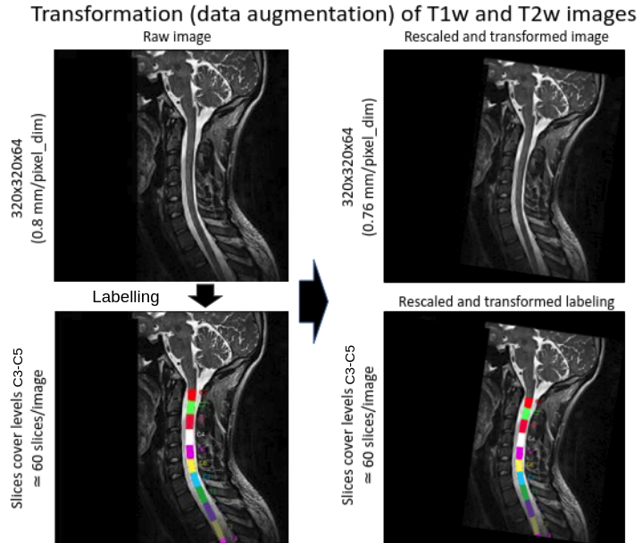

# csa-atrophy

Evaluate the sensitivity of atrophy detection with SCT. The algorithm works as follows:
- Consider subject I --> sI
- Applies a rescaling on the native image (e.g. 1, 0.95, 0.8) --> rX
- Applies random affine transformation --> tY
- Segment the cord
- Compute CSA --> CSA(sI, rX, tY)

After everything is done, compute stats:
- intra-subject MEAN: MEAN[CSA(sI, rX, :)] --> MEAN_intra(sI, rX)
- intra-subject STD (per subject): STD[CSA(sI, rX, :)] --> STD_intra_sub(sI, rX)
- intra-subject COV (per subject): STD[CSA(sI, rX, :)] / MEAN[CSA(sI, rX, :)] --> COV_intra_sub(sI, rX)
- intra-subject STD: MEAN[STD_intra_sub(:, rX)] --> STD_intra(rX)
- intra-subject COV: MEAN[COV_intra_sub(:, rX)] --> COV_intra(rX)
- inter-subject STD: STD[MEAN_intra(:, rX)] --> STD_inter(rX)

- rescale_estimated_subject MEAN: MEAN[CSA(sI, rX, :)] / MEAN[CSA(sI, 1, :)] --> MEAN_rescale_estimated_subject(sI, rX)
- rescale_estimated (across subjects) MEAN: MEAN[MEAN_rescale_estimated_subject(:, rX)] --> MEAN_rescale_estimated(rX)
- rescale_estimated (across subjects) STD: STD[MEAN_rescale_estimated_subject(:, rX)] --> STD_rescale_estimated(rX)

- error (across subjects) MEAN: MEAN[MEAN_error_intra(:, rX)]
- error (across subjects) STD: STD[MEAN_error_intra(:, rX)]
- sample size: [(z(uncertainty) + z(power))^2 * (2 * STD[MEAN(:, rX)]^2)] / [MEAN[CSA(sI, 1, :)] - MEAN[CSA(sI, rX, :)]] 

Plot results:
- STD_intersub
- Mean and STD inter-subject error percentage in function of rescaling
- sample size: minimum number of patients to detect an atrophy of X with Y% power and Z% uncertainty
- CSA values boxplot in function of rescaling
- Error values boxplot in function of rescaling

# How to run

This code has been tested using Python 3.7.

Download (or git clone) this repository:
~~~
git clone https://github.com/sct-pipeline/csa-atrophy.git
cd csa-atrophy
~~~
Installation:
csa-atrophy requires specific python packages for computing statistics and processing images. If not already present on the computer's python environment such packages will automatically be installed by running pip command:
~~~
pip install -e .
~~~

Download the [Spine Generic Multi-Subject dataset](https://github.com/spine-generic/data-multi-subject#download). 

Edit the file `config_sct_run_batch.yml` according to your setup. Notable flags include:
- `path_data`: If you downloaded the spine-generic data at another location, make sure to update the path;
- `include_list`: If you only want to run the script in a few subjects, list them here. Example:
  `include_list: ['sub-unf04', 'sub-unf05']`

See `sct_run_batch -h` to look at the available options.

Run the analysis:
~~~
sct_run_batch -config config_sct_run_batch.yml
~~~

:note: **desired subjects using flag -include and in parallel processing using flag -jobs.**

To output statistics, run in Dataset
~~~
csa_rescale_stat -i csa_atrophy_results/results -o csa_atrophy_results -config config_script.yml -v
~~~

# Quality Control

After running the analysis, check your Quality Control (QC) report by opening the file qc/index.html. Use the 
“Search” feature of the QC report to quickly jump to segmentations or labeling results. If you spot issues 
(wrong labeling), add their filenames in the 'config_correction.yml' file 
(see https://spine-generic.rtfd.io/en/latest/analysis-pipeline.html for further indications). Then, manually create 
labels in the cord at the level of inter-vertebral discs C1-C2, C2-C3, ..., C4-C5 with the command:
~~~
manual_correction -config config_correction.yml -path-in csa_atrophy_results/data_processed -path-out PATH_DATA
~~~
The bash script outputs all manual labelings to the derivatives directory in the dataset path defined in `path_data`.
It is now possible to re-run the whole process. With the command below labeling will use the manual corrections that
are present in the derivatives/ folder of the dataset, otherwise labeling will be done automatically.
~~~
sct_run_batch -config config_sct_run_batch.yml
~~~
