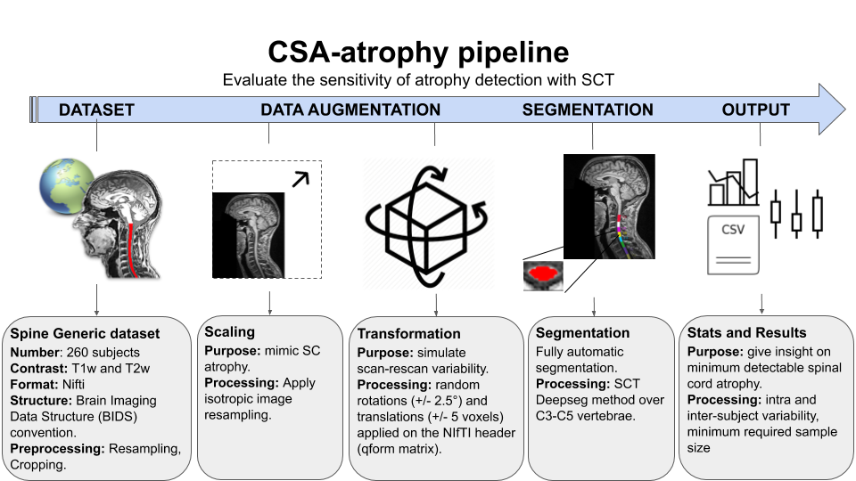

CSA-atrophy
============
CSA-atrophy evaluates the robustness and the sensitivity of an automated analysis pipeline for detecting SC atrophy. Notably, the proposed framework utilizes image scaling and applies a random rigid transformation to mimic subject repositioning (scan-rescan). This enables the quantification of the accuracy and precision of the estimated CSA across various degrees of simulated atrophy. As presented below, statistics from these experiments such as power analyses and minimum sample sizes are derived.

.. toctree::
   :maxdepth: 1
   :caption: Overview

   overview.rst

.. toctree::
   :hidden:
   :maxdepth: 1
   :caption: Statistics

   statistics/intro.rst
   statistics/intra_subject.rst
   statistics/inter_subject.rst
   statistics/sample_size.rst
